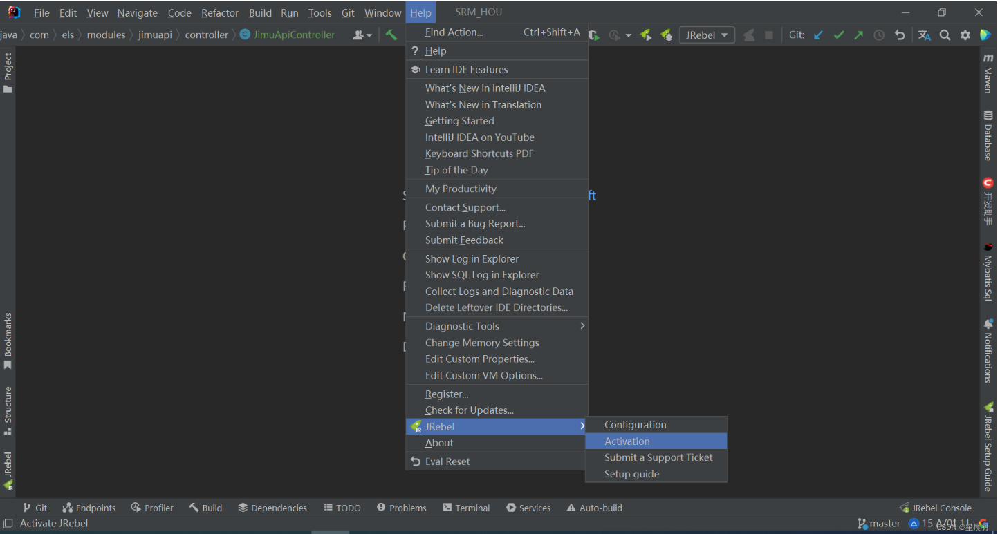
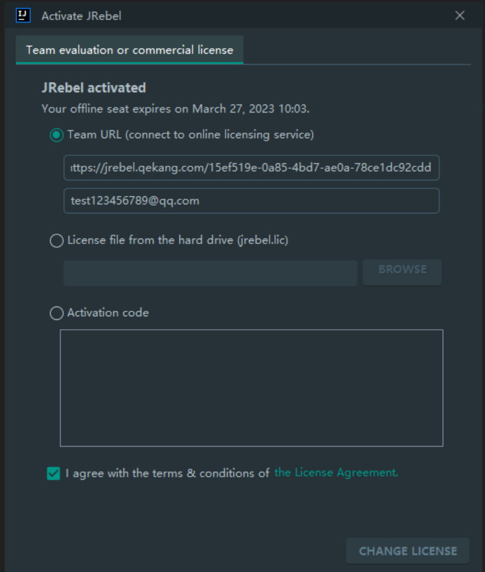
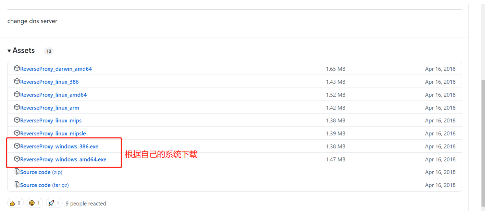
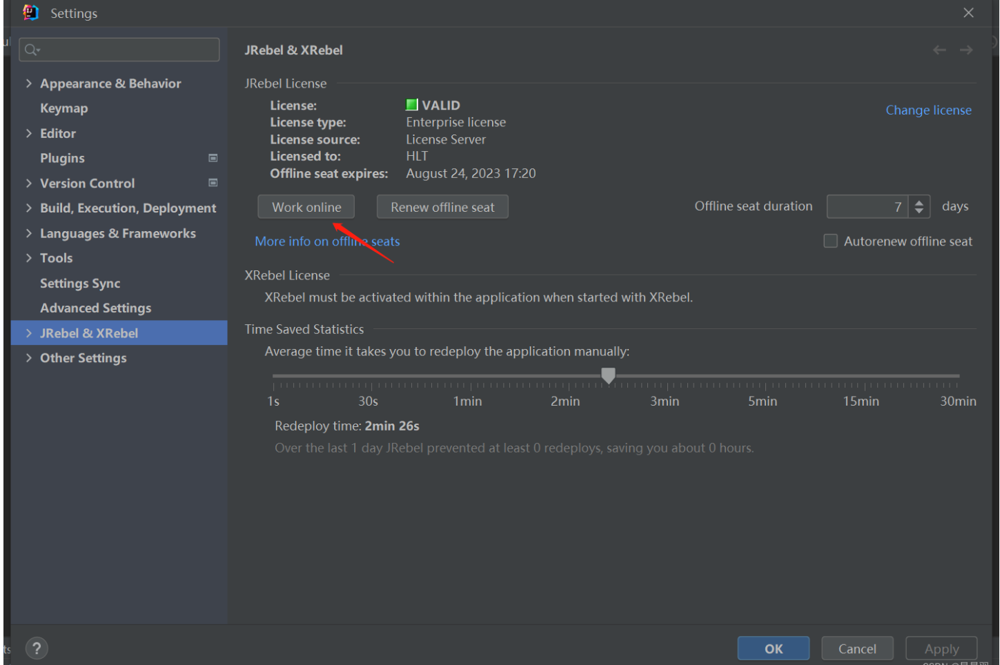

# idea中热部署插件JRebel最新激活方式

## 一、打开jrebel 激活面板，如图：






## 二、选中Team URL（connect to online licensing service）

1、在上面的框中输入激活的url地址

```html
https://jrebel.qekang.com/{GUID}
```

 GUID在线生成地址

（1）、[在线生成GUID1](http://www.ofmonkey.com/transfer/guid)

（2）、[在线生成GUID2](https://www.guidgen.com/)

## 三、报ls client not configured 错误

需要[在此处](https://github.com/ilanyu/ReverseProxy/releases/tag/v1.4)下载自己机器系统相对应的工具




下载之后运行，然后打开jrebel激活工具，然后输入地址激活即可

```html
http://127.0.0.1:8888/{GUID}
```


## 四、激活成功后进入settting后，选择【JRebel】，然后点击【Work online】按钮




lll