# Redis 6.0.8 安装与配置

## 一、下载解压Redis

[Redis官方网站](https://redis.io/)手动下载，或命令下载：（也可以选择[Redis中文网](http://www.redis.cn/)下载），或直接参考[Redis官网下载安装](https://redis.io/download)说明

```bash
# 下载redis 该命令会直接下载在当前目录
wget http://download.redis.io/releases/redis-6.0.8.tar.gz 

# 解压在当前目录
# -z或--gzip或--ungzip：通过gzip指令处理备份文件
# -x或--extract或--get：从备份文件中还原文件
# -v或--verbose：显示指令执行过程
# -f<备份文件>或--file=<备份文件>：指定备份文件
tar -zxvf  redis-6.0.8.tar.gz 
```


## 二、安装环境

```bash
yum install gcc-c++ # 一般系统已经安装好了
yum -y install centos-release-scl
yum -y install devtoolset-9-gcc devtoolset-9-gcc-c++ devtoolset-9-binutils 

-------环境设置----------
#临时有效，退出 shell 或重启会恢复原 gcc 版本
scl enable devtoolset-9 bash
#长期有效
echo "source /opt/rh/devtoolset-9/enable" >>/etc/profile

```


## 三、安装

```bash
cd /redis-6.0.8 # 进入 redis 解压目录
make # 编译
make install PREFIX=/usr/local/redis/redis-6.0.8 # 指定安装目录

 ##会将Redis安装在指定位置：　/usr/local/redis-6.0.8/bin   （bin是安装自动生成的）
```


**各个功能模块介绍**

| 模块名称            | 模块功能介绍                           |
| :------------------ | :------------------------------------- |
| **redis-server**    | Redis服务器                            |
| **redis-cli**       | Redis命令行客户端                      |
| **redis-benchmark** | Redis性能测试                          |
| **redis-check-aof** | AOF文件修复工具                        |
| **redis-check-rdb** | RDB文件修复工具                        |
| **redis-sentinel**  | Sentinel服务器(2.8以后)，Redis集群使用 |


## 四、配置redis

```bash
# 复制redis核心配置文件在原来的下载安装命令目录中（默认位置在/usr/local/bin），我的文件下载在/home/redis/download/redis-6.0.8目录下，配置文件也在这里
cd /usr/local/redis/redis-6.0.8/bin/
# 查看当前目录文件
ls
# 创建放置配置文件的目录
mkdir conf
# 复制配置文件 到 conf 目录
cp /home/redis/download/redis-6.0.8/redis.conf /usr/local/redis/redis-6.0.8/bin/conf/

```


## 五、测试redis

```bash
# 再开一个命令行 进入redis bin目录下
cd /usr/local/redis/redis-6.0.8/bin

# 运行redis客户端 并执行ping命令
./redis-cli -p  6379
# 效果
# 127.0.0.1:6379> ping
# PONG


```

> 当前的 redis 并未设置自启动 每次关机后还会关闭，开机后需要再次启动，因此设置开启自启动


## 六、配置后台启动 

> 备份当前配置文件，以便后续出现问题能够恢复

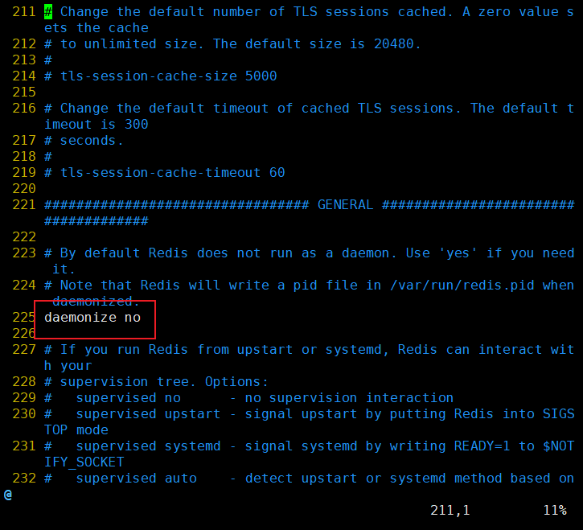

```bash
# 备份
cp redis.conf redis.conf.backup

# 修改配置文件
vim redis.conf

# vim 命令行模式下 通过以下命令找到daemonize no
/daemonize no

# 将其修改成yes
```


## 七、远程操作Redis

* 修改 `redis.conf` 配置文件：

  ```bash
  # 注释bind 127.0.0.1
  # 设置protected-mode no
  # 设置requirepass root  ## requirepass 代表设置认证密码
  ```

  

* 开放端口：

  ```bash
  firewall-cmd --zone=public --add-port=6379/tcp --permanent
  ```

  


## (放弃了)配置开机自启动

通过指定配置的方式启动 redis 已经方便很多，其实还能更加方便，那就是通过设置 redis 开机自启，省去了自己手动启动 redis 带来的麻烦。

* 首先，新建一个开机自启动脚本 :

  ```bash
  vim /etc/init.d/redis
  ```

* 然后，将下面的内容写入开机自启动脚本中：

  ```sh
  #!/bin/sh
  # 
  # description: Start and Stop redis   
    
  PATH=/usr/local/bin:/sbin:/usr/bin:/bin   #找到本机安装redis后，存放redis命令的目录 
  REDISPORT=6379                            #redis的默认端口， 要和下文中的redis.conf中一致
  EXEC=/usr/local/redis/redis-6.0.8/bin/redis-server           #redis服务端的命令
  REDIS_CLI=/usr/local/redis/redis-6.0.8/bin/redis-cli         #redis客户端的命令  这两个一般都在 PATH目录下
  PIDFILE=/var/run/redis.pid                #reids的进程文件生成的位置
  CONF="/usr/local/redis/redis-6.0.8/bin/conf/redis.conf"           #redis的配置文件所在的目录 
   
  case "$1" in   
          start)   
                  if [ -f $PIDFILE ]   
                  then   
                          echo "$PIDFILE exists, process is already running or crashed."  
                  else  
                          echo "Starting Redis server..."  
                          $EXEC $CONF   
                  fi   
                  if [ "$?"="0" ]   
                  then   
                          echo "Redis is running..."  
                  fi   
                  ;;   
          stop)   
                  if [ ! -f $PIDFILE ]   
                  then   
                          echo "$PIDFILE exists, process is not running."  
                  else  
                          PID=$(cat $PIDFILE)   
                          echo "Stopping..."  
                         $REDIS_CLI -p $REDISPORT  SHUTDOWN    
                          sleep 2  
                         while [ -x $PIDFILE ]   
                         do  
                                  echo "Waiting for Redis to shutdown..."  
                                 sleep 1  
                          done   
                          echo "Redis stopped"  
                  fi   
                  ;;   
          restart|force-reload)   
                  ${0} stop   
                  ${0} start   
                  ;;   
          *)   
                 echo "Usage: /etc/init.d/redis {start|stop|restart|force-reload}" >&2  
                  exit 1  
  esac
  ```

* 修改执行权限：

  ```bash
  chmod +x /etc/init.d/redis
  
  ```

* 测试redis启动和停止：

  ```bash
  service redis start
  service redis stop
  
  ```

*  开启服务自启动：

  ```bash
  chkconfig redis on
  
  ```

* 打开redis：

  ```bash
  service redis start
  
  ```

* 关闭redis：

  ```bash
  service redis stop
  ```


##### 为什么不能正常关闭redis(可能会存在不能正常关闭的情况)

> 查看redis.pid

```
# 在脚本中,有一行代码是存放redis.pid目录
# PIDFILE=/var/run/redis.pid
# 进入 /var/run 目录 
cd /var/run/ 
```

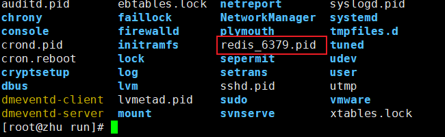

<font color='red' >**发现redis_6379.pid 文件并不是我想要的文件 **</font>

> 修改redis配置文件

```bash
pidfile /var/run/redis.pid # 文件中为 redis_6379.pid 需要改成这个样子
```


# RabbitMQ安装与配置

> 查看mq 对应的 erlang 的版本

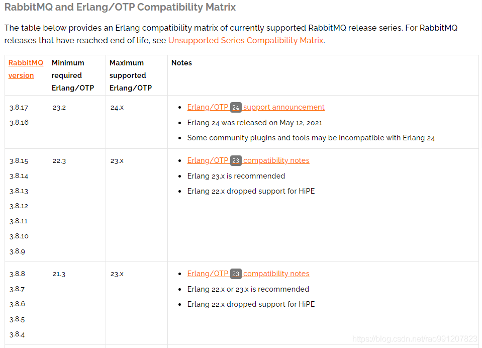


## 一、安装erlang

>  **在 https://github.com/rabbitmq/erlang-rpm/releases 页面找到需要下载的erlang版本**，如：[erlang](https://so.csdn.net/so/search?q=erlang&spm=1001.2101.3001.7020)-*-1.el7.x86_64.rpm就是centos7 版本的。

* **使用 wget 命令下载erlang，例如：我的 Linux 系统是 CentOS7 ，使用的RabbitMQ是3.8.9，erlang是23.x（官方组合）**：

  ```bash
  ## 指定下载位置
  wget -P /home/erlang https://github.com/rabbitmq/erlang-rpm/releases/download/v23.0/erlang-23.0-1.el7.x86_64.rpm
  ```

  **注意**：虚拟机可能报错”无法建立 SSL 连接“，此时需要将 https 替换为 http，再试一次，如果还是无法下载，那么只能通过本地上传的方式处理。

* 安装erlang：

  ```bash
  rpm -Uvh /home/erlang/erlang-23.0-1.el7.x86_64.rpm
  ```

* 安装socat：

  ```bash
  yum install -y socat
  ```


## 二、安装RabbitMQ

> 在[官方下载页面](https://www.rabbitmq.com/download.html)找到CentOS7版本的下载链接，下载rpm安装包

```bash
wget -P /home/erlang https://github.com/rabbitmq/rabbitmq-server/releases/download/v3.8.9/rabbitmq-server-3.8.9-1.el7.noarch.rpm
```

`提示：可以在 https://github.com/rabbitmq/rabbitmq-server/tags 或者 https://github.com/rabbitmq/rabbitmq-server/releases 下载历史版本`

* 安装RabbitMQ：

  ```bash
  rpm -Uvh /home/erlang/rabbitmq-server-3.8.9-1.el7.noarch.rpm
  ```

* 启动服务：

  ```bash
  systemctl start rabbitmq-server
  ```

* 查看状态：

  ```bash
  systemctl status rabbitmq-server
  ```

* 停止服务：

  ```bash
  systemctl stop rabbitmq-server
  ```

* 设置开机自启：

  ```bash
  systemctl enable rabbitmq-server
  ```


## 三、开启web管理插件

* **开启插件：**

  ```bash
  rabbitmq-plugins enable rabbitmq_management
  ```

  <font color='#07009200'>`说明：rabbitmq有一个默认的guest用户，但只能通过localhost访问，所以需要添加一个能够远程访问的用户。`</font>

* **添加用户：**

  ```bash
  rabbitmqctl add_user admin admin
  ```

* **为用户分配操作和资源权限：**

  ```bash
  rabbitmqctl set_user_tags admin administrator
  
  rabbitmqctl set_permissions -p / admin ".*" ".*" ".*"
  ```

## 四、开启防火墙

> RabbitMQ 服务启动后，还不能进行外部通信，需要将端口添加都防火墙

* 添加端口：

  ```bash
  firewall-cmd --zone=public --add-port=4369/tcp --permanent
  firewall-cmd --zone=public --add-port=5672/tcp --permanent
  firewall-cmd --zone=public --add-port=25672/tcp --permanent
  firewall-cmd --zone=public --add-port=15672/tcp --permanent
  
  ```

* **重启防火墙**：

  ```bash
  firewall-cmd --reload
  ```


## 五、浏览器访问测试

>  浏览器输入：`http://ip` + 端口(15672)，例如：`http://192.168.1.1:15672`
>
>  如果在本机则直接使用：http://localhost:15672 进行访问，输入访问用户与密码访问即可。

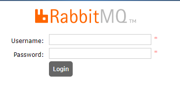


# Java环境安装与配置

## 一、手动解压安装包：

### 1、在user目录下新建java文件夹：

```bash
cd /usr/

mkdir java

cd java
```

### 2.下载jdk1.8：

>  进入http://www.oracle.com/technetwork/java/javase/downloads/jdk8-downloads-2133151.html，复制下载目录; 
>
> 注意：
>
> 从官网下载需要进行注册登录才能够得到下载链接（不推荐）

```bash
wget http://download.oracle.com/otn-pub/java/jdk/8u172-b13/96a7b8442fe848ef90c96a2fad6ed6d1/jdk-8u172-linux-i586.tar.gz?AuthParam=1534129356_6b3ac55c6a38ba5a54c912855deb6a22

```

### 3、解压：使用tar -zxvf 文件名进行解压：

```bash
tar -zxvf jdk-8u172-linux-i586.tar.gz
```

### 4、配置环境变量：

```bash
vim /etc/profile
```

将如下配置添加至文件中，然后保存退出:

```bash
export JAVA_HOME=/usr/java/jdk1.8
export PATH=$JAVA_HOME/bin:$PATH
export CLASSPATH=.:$JAVA_HOME/lib/dt.jar:$JAVA_HOME/lib
```

### 5、验证：

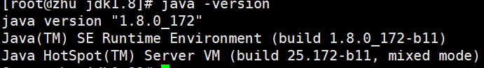


## 二、yum安装：

### 1、搜索jdk安装包:

```bash
yum search java|grep jdk
```

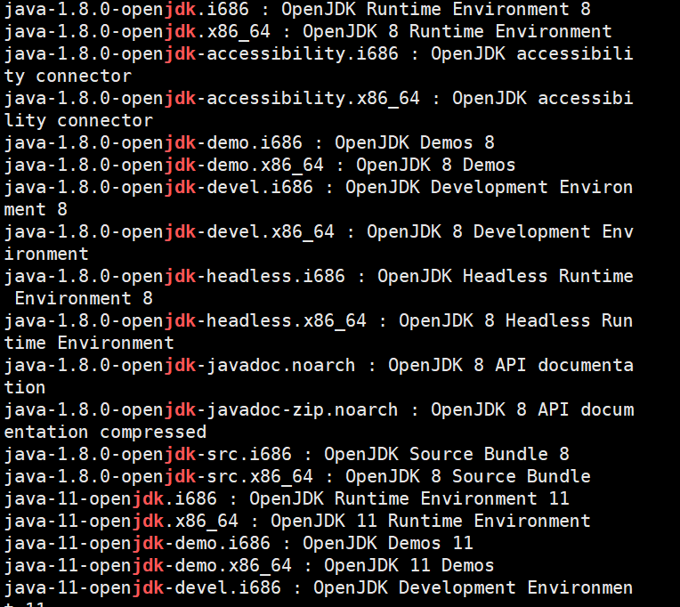

### 2、下载jdk1.8，下载之后默认的目录为： /usr/lib/jvm/

```bash
yum install java-1.8.0-openjdk
```

### 3、配置环境变量及验证安装。


## 三、使用rpm安装：

### 1、下载rpm的安装包：

```bash
wget http://download.oracle.com/otn-pub/java/jdk/8u181-b13/96a7b8442fe848ef90c96a2fad6ed6d1/jdk-8u181-linux-x64.rpm?AuthParam=1534132498_e541d098d71f6243516fa69cd17eba60
```


### 2、使用rpm命令安装：

```bash
rpm -ivh jdk-8u172-linux-i586.rpm
```

### 3、配置环境变量、验证安装。

> 问题：

安装jdk后配置环境变量，使用java -[version](https://so.csdn.net/so/search?q=version&spm=1001.2101.3001.7020)测试是否配置成功，报错
-bash: /usr/local/jdk1.8.0_181/bin/java: /lib/ld-linux.so.2: bad ELF interpreter: 没有那个文件或目录


执行下面的命令

```
yum install glibc.i686
```


# Maven环境安装与配置

## 1、下载maven包

```bash
wget http://mirrors.tuna.tsinghua.edu.cn/apache/maven/maven-3/3.6.3/binaries/apache-maven-3.6.3-bin.tar.gz
```

如果提示 `wget: 未找到命令`，请尝试如下指令安装 `wget`

```bash
yum -y install wget
```

## 2、解压下载的maven压缩包

```bash
tar -xzvf apache-maven-3.6.3-bin.tar.gz
```

- -x：从备份文件中还原文件
- -z：处理备份文件
- -v：显示指令执行过程
- -f：指定备份文件

## 3、配置系统maven环境

编辑系统环境文件`profile`，该文件类似于windows里的环境变量。

```bash
vim /etc/profile
```

注意，配置的变量，请指向自己解压的maven路径：

```bash
export MAVEN_HOME/usr/local/maven/apache-maven-3.6.3
export PATH=$MAVEN_HOME/bin:$PATH
```

`:wq`，退出保存，然后重新加载一下配置：

```
source /etc/profile
```

查看maven版本，测试配置生效：

```
mvn -v
```

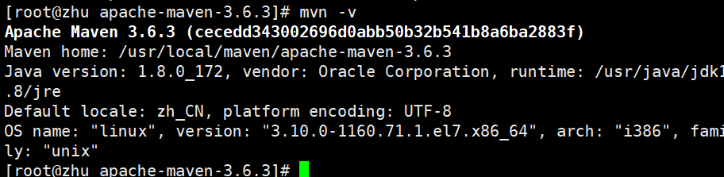

## 4、配置镜像加速+指定仓库地址

配置jar包下载路径，路径指向自己的。

```
# 设置仓库目录
mkdir /usr/local/maven/repo
```

* 打开maven配置文件：

  ```
  # 进入配置文件目录 备份maven 配置文件
  cd conf/
  cp settings.xml settings.xml.bak
  
  # 编辑配置文件
  vim settings.xml
  ```

```xml
<!-- 在图中相关位置加入相应配置-->

<localRepository>/usr/local/maven/repo</localRepository>


<mirror>
	<id>alimaven</id>
	<name>aliyun maven</name>
	<url>http://maven.aliyun.com/nexus/content/groups/public/</url>
	<mirrorOf>central</mirrorOf>    
</mirror>

```

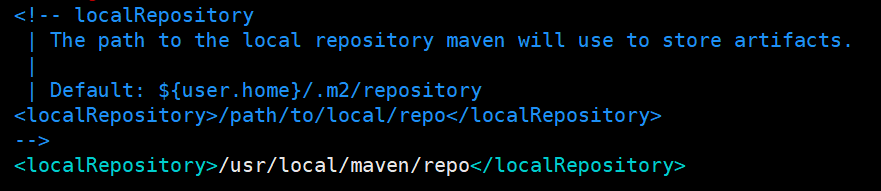

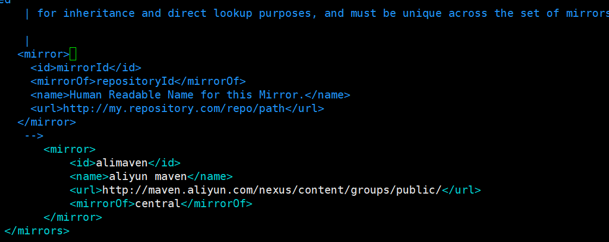

`:wq`保存并退出


# Mysql安装与配置

## 检查是否安装果mysql

> ps:因为以前用yum安装过，所以先用yum卸载。如果不是此方式或者没安装过则跳过

```bash
yum remove mysql
```

> 查看是否有mysql依赖 有的话则卸载

```
rpm -qa | grep mysql
```

```
//普通删除模式
rpm -e xxx(mysql_libs)
//强力删除模式,如果上述命令删除时，提示有依赖其他文件，则可以用该命令对其进行强力删除
rpm -e --nodeps xxx(mysql_libs)

```

> 检查是否有mariadb

```
rpm -qa | grep mariadb


```

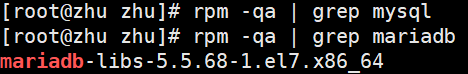

> 有则卸载

```bash
rpm -e --nodeps mariadb-libs-5.5.68-1.el7.x86_64
```

## 安装MySQL Server

### 添加国内安装源并安装

切换目录，如果没有，需新建：

```
mkdir /usr/local/mysql

cd /usr/local/mysql

```


下载：

```
wget http://mirrors.tuna.tsinghua.edu.cn/mysql/yum/mysql80-community-el7/mysql80-community-release-el7-1.noarch.rpm

```

安装：

```
rpm -ivh mysql80-community-release-el7-1.noarch.rpm

```

下载完成后，yum安装：

```
yum install mysql-server

```


### 遇到问题：

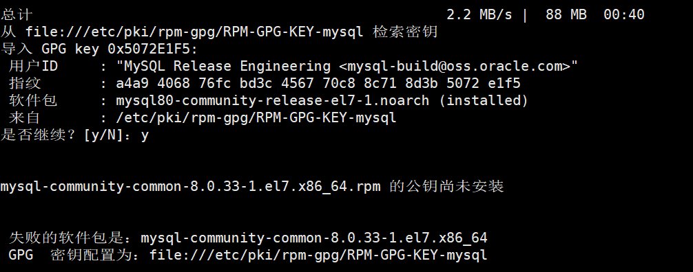

### 解决问题：

参考博客：[解决CentOS yum安装Mysql8提示“公钥尚未安装”或“密钥已安装，但是不适用于此软件包”的问题_一介布衣萧萧的博客-CSDN博客](https://blog.csdn.net/brantyou/article/details/124114996)

#### 这个时候可参考官网的做法：

> 检查包的签名

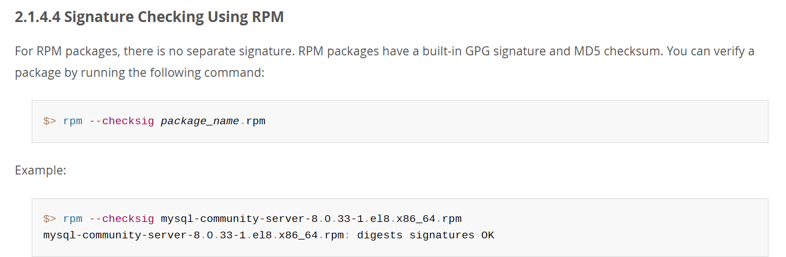

```bash
rpm --checksig package_name.rpm # 包名.rpm 需要找到包所在位置

cd /var/cache/yum/x86_64/7/mysql80-community/packages

# 例如
rpm --checksig mysql-community-server-8.0.33-1.el7.x86_64.rpm
```

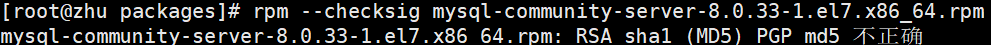

> ps:chicken: 此时MD5 是错误的

通以下命令更新密钥：

```bash
gpg --export -a 3a79bd29 > 3a79bd29.asc
rpm --import 3a79bd29.asc # 如果这个命令不行更换下面那条

rpm --import https://repo.mysql.com/RPM-GPG-KEY-mysql-2022
```


运行成功后 出现截图所示结果代表成功：

```
rpm --checksig mysql-community-server-8.0.33-1.el7.x86_64.rpm
```

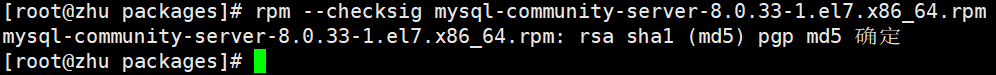


成功之后再次运行：

```
yum install mysql-community-server
```


## mysql启动

- [ ] #### 检查是否已经设置为开机启动MySQL服务

```
systemctl list-unit-files|grep mysqld

```

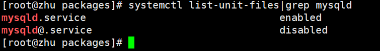

> 表示已成功设置为开机自启动，如果没有设置为开机启动则执行

```
systemctl enable mysqld.service

```


- [ ] #### 启动MySQL

```
systemctl start mysqld.service

```

- [ ] #### 初始化

```
mysqld --initialize

```

- [ ] #### 查看默认密码

```
grep 'temporary password' /var/log/mysqld.log

```

localhost后面的最后的那一大串字符，就是密码，复制下来。

- [ ] #### 登录

  ```
  mysql -uroot -p
  ```

- [ ] #### 重置root密码

  ```mysql
  # 需要先设置一个复杂的密码，不然无法进行下一步操作
  # 大小写字母数字以及特殊符号
  # 例如： AAaa..123
  
  ALTER USER 'root'@'localhost' identified by 'AAaa..123';
  ```

  > ps: 密码不能为 root

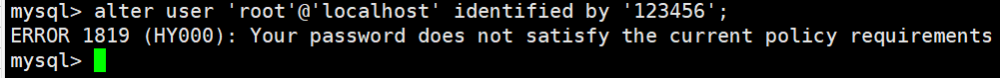

> 此时无法修改密码，由于myql8的隐私政策 密码不能太简单，因此需要修改相关配置

[参考博客--mysql8.0密码策略](https://blog.csdn.net/weixin_49891946/article/details/120791640#:~:text=MySQL8.0%E7%9A%84%E5%AF%86%E7%A0%81%E7%AD%96%E7%95%A5%E5%8F%AF%E4%BB%A5%E4%BD%BF%E7%94%A8%E4%BB%A5%E4%B8%8B%E5%91%BD%E4%BB%A4%E6%9F%A5%E7%9C%8B%E5%92%8C%E4%BF%AE%E6%94%B9%201%201.%E6%9F%A5%E7%9C%8B%E5%AF%86%E7%A0%81%E7%AD%96%E7%95%A5%20--MySQL%E7%99%BB%E5%BD%95%E5%90%8E%E4%BD%BF%E7%94%A8%E8%BF%99%E4%B8%AA%E5%91%BD%E4%BB%A4%E6%9F%A5%E7%9C%8B%E5%AF%86%E7%A0%81%E7%AD%96%E7%95%A5%20show%20variables%20like%20%27validate%25%27%3B,set%20global%20validate_password.mixed_case_count%3D1%3B%20--%E5%AF%86%E7%A0%81%E8%87%B3%E5%B0%91%E8%A6%81%E5%8C%85%E5%90%AB%E7%9A%84%E6%95%B0%E5%AD%97%E4%B8%AA%E6%95%B0%E3%80%82%20...%203%203.%E6%94%B9%E5%AE%8C%E5%AF%86%E7%A0%81%E7%AD%96%E7%95%A5%EF%BC%8C%E5%B0%B1%E5%8F%AF%E4%BB%A5%E6%A0%B9%E6%8D%AE%E8%87%AA%E5%B7%B1%E4%BF%AE%E6%94%B9%E7%9A%84%E7%AD%96%E7%95%A5%EF%BC%8C%E6%9B%B4%E6%94%B9%E5%8C%B9%E9%85%8D%E7%AD%96%E7%95%A5%E7%9A%84MySQL%E7%99%BB%E5%BD%95%E5%AF%86%E7%A0%81%E4%BA%86%20)

```mysql
-- 查看密码策略
show variables like 'validate%';

-- 修改策略
set global validate_password.policy=0;
set global validate_password.length=4;
set global validate_password.mixed_case_count=0;
set global validate_password.number_count=0;
set global validate_password.special_char_count=0；

```

执行上面的设置后才能设置简单密码：

```mysql
ALTER USER 'root'@'localhost' identified by '123456';
```

- [ ] #### 新建用户

  ```mysql
  -- 创建用户
  create user 'user'@'%' identified by '123456';
  
  -- 授权
  GRANT ALL PRIVILEGES ON *.* TO 'user'@'%' WITH GRANT OPTION;
  
  ```

  

