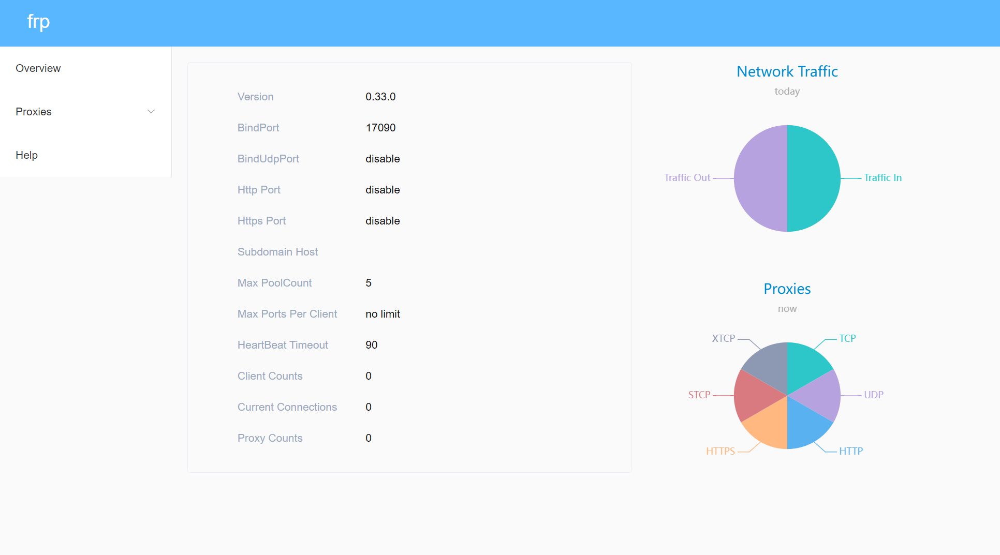
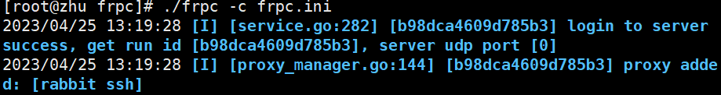

# Frp内网穿透

**前置准备**：

1、一台具有公网ip的服务器；

2、能够联网的电脑；

3、下载Frp脚本。

**4、注意版本！！！注意版本！！！注意版本！！！注意版本！！！注意版本！！！**

> 使用 这个版本 frp_0.33.0_linux_amd64.tar.gz

## 一、服务端配置（公网服务器）

#### 1、下载frp库

```bash
wget https://github.com/fatedier/frp/releases/download/v0.48.0/frp_0.48.0_linux_amd64.tar.gz

# 或使用mwget 需要安装配置

mwget 
https://github.com/fatedier/frp/releases/download/v0.48.0/frp_0.48.0_linux_amd64.tar.gz
```

#### 2、解压frp压缩包

```bash
tar -zxvf frp_0.33.0_linux_amd64.tar.gz
```

#### 3、进入该解压目录

```bash
cd frp_0.33.0_linux_amd64/

```

* 打开配置文件:

  ```bash
  vim frps.ini
  ```

  

* 将文件内容修改为如下：

  ```bash
  [common]
  # frp监听的端口，默认是7000，可以改成其他的
  bind_port = 17090
  # 授权码，请改成更复杂的
  # 这个token之后在客户端会用到
  token = 52010
  
  # frp管理后台端口，请按自己需求更改
  dashboard_port = 17100
  # frp管理后台用户名和密码，请改成自己的
  dashboard_user = admin
  dashboard_pwd = admin
  enable_prometheus = true
  
  # frp日志配置
  log_file = /var/log/frps.log
  log_level = info
  log_max_days = 3
  
  
  ```

#### 4、设置和启动frp服务

```bash

sudo mkdir -p /etc/frp
sudo cp frps.ini /etc/frp
sudo cp frps /usr/bin
sudo cp systemd/frps.service /usr/lib/systemd/system/
sudo systemctl enable frps
sudo systemctl start frps


```

#### 5、防火墙开放端口(可以利用宝塔面板)

```
# 添加监听端口
sudo firewall-cmd --permanent --add-port=17090/tcp
# 添加管理后台端口
sudo firewall-cmd --permanent --add-port=17100/tcp
sudo firewall-cmd --reload

```

#### 6、验证服务端是否启动成功

> 访问：http://服务器IP:后台管理端口” ，输入用户名和密码可以查看连接状态
> 如：http://ip:17100/，用户名和密码分别对应frps.ini文件中的dashboard_user和dashboard_pwd





## 这个内容不用看

````markdown


# frp -version : 0.48.0
# 以下配置出现错误


* **设置服务：**

```bash
vim /lib/systemd/system/frps.service
```

* **写入以下内容：**

```bash
[Unit]
Description = frps service
After = network.target syslog.target
Wants = network.target

[Service]
Type = simple
#启动服务的命令（此处写你的frps的实际安装目录）
ExecStart = /home/lighthouse/frps33/frps -c /home/lighthouse/frps33/frps.ini

[Install]
WantedBy = multi-user.target
```

* **启动：**

```bash
systemctl start frps # 开启frps

systemctl enable frps # 设置自启动
```

如果上述命令依次执行完没有任何错误出现，则说明启动成功。
````


## 二、客户端配置（本机虚拟机）

#### 1、下载frp库

```bash
wget https://github.com/fatedier/frp/releases/download/v0.48.0/frp_0.48.0_linux_amd64.tar.gz

# 或使用mwget 需要安装配置

mwget 
https://github.com/fatedier/frp/releases/download/v0.48.0/frp_0.48.0_linux_amd64.tar.gz
```

#### 2、解压frp压缩包

```bash
tar -zxvf frp_0.33.0_linux_amd64.tar.gz
```

#### 3、进入该解压目录

```bash
cd frp_0.33.0_linux_amd64/

```

* 打开配置文件：

  ```bash
  vim frpc.ini  (注意哦，不是frps.ini)
  ```

* 将文件内容修改为如下:

  ```bash
  # 客户端配置
  [common]
  # 服务器ip
  server_addr = 175.178.103.19 
   # 与frps.ini的bind_port一致
  server_port = 17090
   # 与frps.ini的token一致
  token = 52010
  
  # 配置ssh服务
  [ssh]
  type = tcp
  local_ip = 127.0.0.1
  local_port = 22
   # 这个自定义，之后再ssh连接的时候要用
  remote_port = 17091 
  
  # 配置rabbit服务
  [rabbit]
  type = http
  local_ip = 127.0.0.1
  local_port = 15672
  remote_port = 17092 
  
  # 配置http服务，可用于小程序开发、远程调试等，如果没有可以不写下面的
  # [web]
  # type = http
  # local_ip = 127.0.0.1
  # local_port = 8080
  # web域名
  # subdomain = test.hijk.pw
  # 自定义的远程服务器端口，例如8080
  # remote_port = 8080
  
  ```
  
  #### 4、启动frpc服务
  
  ```bash
  ./frpc -c frpc.ini
  
  ```
  
  