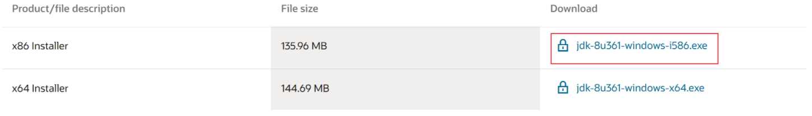
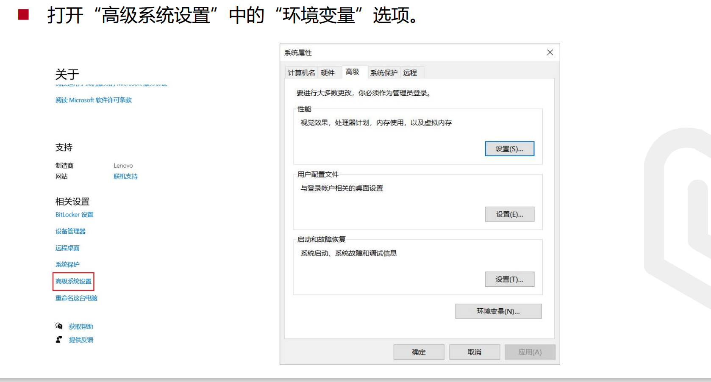
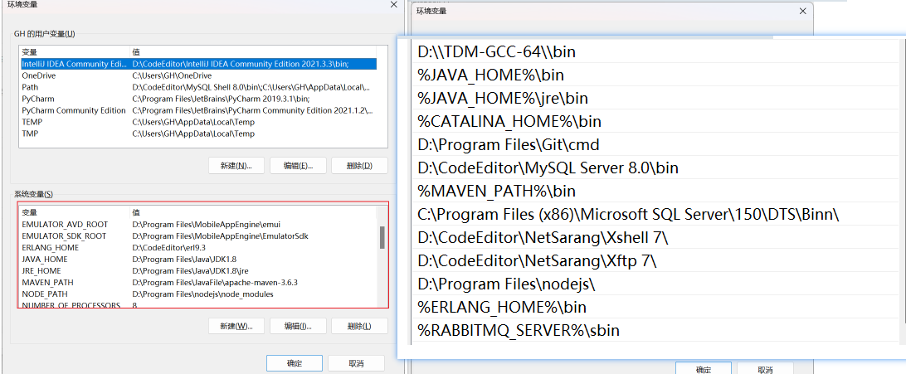
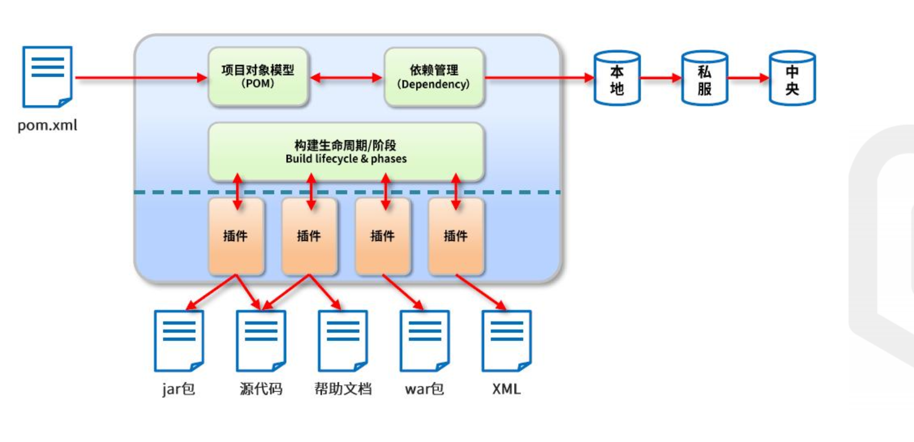
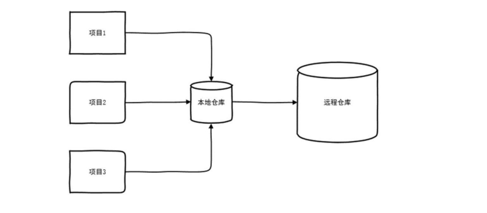
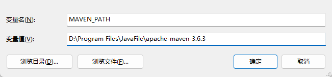
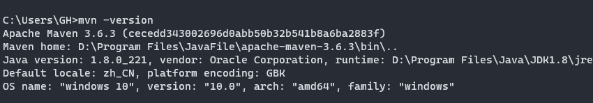
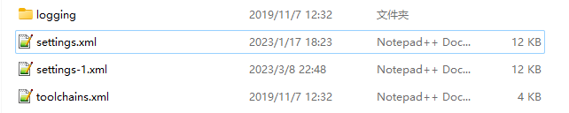
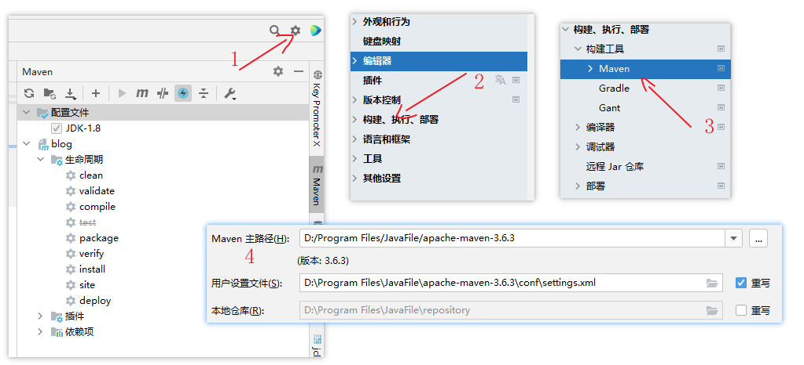

## java环境配置

> 下载JDK安装包  [JDK安装包下载]([Java Downloads | Oracle](https://www.oracle.com/java/technologies/downloads/#java8-windows))



> 双击安装Java




> 配置JAVV_HOME 和 JRE_HOME




## Maven环境配置

> maven 是一个项目管理工具， 可以对`java`项目进行自动化的构建和依赖管理



> 当运行Maven的时候，Maven所需要的任何构件都是直接从本地仓库获取的，如果本地仓库没有，它将会尝试从远程仓库下载到本地



> 安装maven步骤

* 从官网下载[apache-maven-3.6.3-bin.zip](https://dlcdn.apache.org/maven/maven-3/3.6.3/binaries/apache-maven-3.6.3-bin.zip)

* 直接解压再本地文件夹，`D://envs/maven/...`下（可以根据自己要求选择）
* 配置环境变量MAVEN_HOME,例如：



* 并将其配置到PATH中，`%MAVEN_HOME%\bin`,然后通过cmd命令行输入`mvn -version`查看版本（"前提是一定要配好java环境"）



* 接着在maven 的 目录下找到`conf`,可以保存一份setting文件， 复制一份然后修改其中的配置




* 打开setting.xml文件, 找到对应的标签，并添加进去

```xml
  <localRepository>
	D:\Program Files\JavaFile\repository
  </localRepository>
  
  
  	 <!-- 阿里云仓库 -->
	<mirror>
		<id>alimaven</id>
		<mirrorOf>central</mirrorOf>
		<name>aliyun maven</name>
		<url>http://maven.aliyun.com/nexus/content/repositories/central/</url>
	</mirror>

	<!-- 中央仓库1 -->
	<mirror>
		<id>repo1</id>
		<mirrorOf>central</mirrorOf>
		<name>Human Readable Name for this Mirror.</name>
		<url>http://repo1.maven.org/maven2/</url>
	</mirror>

	<!-- 中央仓库2 -->
	<mirror>
		<id>repo2</id>
		<mirrorOf>central</mirrorOf>
		<name>Human Readable Name for this Mirror.</name>
		<url>http://repo2.maven.org/maven2/</url>
	</mirror>

  
  	<profile>     
		<id>JDK-1.8</id>       
		<activation>       
			<activeByDefault>true</activeByDefault>       
			<jdk>1.8</jdk>       
		</activation>       
		<properties>       
			<maven.compiler.source>1.8</maven.compiler.source>       
			<maven.compiler.target>1.8</maven.compiler.target>       
			<maven.compiler.compilerVersion>1.8</maven.compiler.compilerVersion>       
		</properties>       
	</profile>

  
```


* 最后在`idea`中，按照下面的步骤修改配置，记得在本地添加自己的仓库（源仓库在用户目录下的 `.m2` 文件夹中）




